# Errata and additional Notes 
v. 1.01-031923

Thank you for purchasing the Check Point Firewall Administration R81.10+!
Despite my best efforts, some errors are present in the book and are addressed here. In addition to this errata, a separate document, Check Point Lab Rapid Deployment Guide (replacing Chapters 3 and 4) is made available to you in the book’s GitHub repository. 
The Rapid Deployment Guide is there to significantly speed-up the creation of the lab environment, taking into consideration updated version of VirtualBox. Scripts were updated as well to allow for new version of VirtualBox, R81.10 and R81.20 versions of Check Point, as well as choices of Intel or AMD CPUs in your LabHost PC.
Tremendows thanks to Tim Hall, who has pointed out some of the pertinent additional information and few mistakes, and to Seth Holcomb, who has meticulously documented and shared with me his experience and encountered issues with the book and its labs.

## Chapter 1 - Introduction to Check Point Firewalls and Threat Prevention Products
 ### Page 13

  >**Note**

  >One effect of a SMS being down for a long time is that CRL retrieval can fail after the cache expires in a week, which will break certificate-based VPNs and various other certificate-based operations.

## Chapter 3 – Building a Check Point Lab Environment – Part 1
## Chapter 4 – Building a Check Point Lab Environment – Part 2
### Page 67 to Page 147

 >**Note**

 >_Chapters 3 and 4 are now replaced by the updated Check Point Lab Rapid Deployment Guide in this book’s GitHub repository. The guide referencing updated scripts in book’s GitHub repository and is available at:
 https://github.com/PacktPublishing/Check-Point-Firewall-Administration-R81.10-/blob/main/Check%20Point%20Lab%20Rapid%20Deployment%20Guide.pdf
 This is done to address inaccuracies in the way the scripts were depicted in the book, changes introduced in VirtualBox v. 7.0.X and to speed-up and simplify the lab deployment process._

## Chapter 5 -  Gaia OS, the First Time Configuration Wizard, and an Introduction to the Gaia Portal (WebUI)

 ### Page 174

  ***Step 8***

  The `admin hash=’<value>’`  has a leading space after single quote, it should not be there.

 ### Page 183

  ***Step 5*** states: _Enter the subnet mask for this interface, `/24 or 255.255.255.0`._ 
  
  The `/24` CIDR is for references only, enter `255.255.255.0`.

 ### Page 188

 ***Figure 5.35*** shows default route before it was configured on **CPCM1**. It was configured by **FTW** on **CPCM2** only. 
  1. On **CPCM1**, you will see the following in **IPv4 Static Routes** [1]. Click on **Default** [2] and, when it is selected, click on **Edit** [3]:

 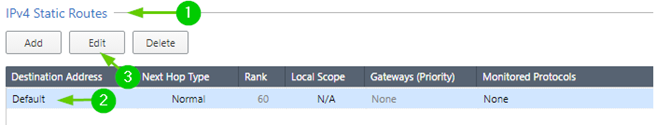
 
***Figure E5.1 — Editing automatically created Default Route, Step1***

 2. In **Edit Destination Route: Default** popup window [1]. Click on **Add Gateway** [2] and click on **IP Address** [3]:

 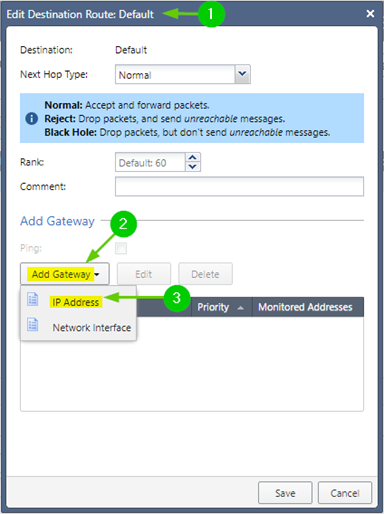
 
 ***Figure E5.2 — Editing automatically created Default Route, Step2***

 3. In **Add IP Address Gateway** child popup window [1] **IPv4 Address**, enter `200.100.0.254` [2] and click **OK** [3]:

 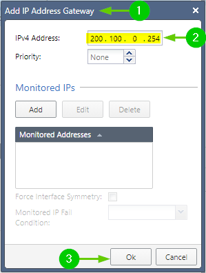
 
 ***Figure E5.3 — Editing automatically created Default Route, Step3***

 Click **Save** in the parent popup window to close it. Only now do you see the **Default route** as shown in ***Figure 5.35***.

## Chapter 7 — SmartConsole – Familiarization and Navigation

 ### Page 243

 In ***Step 1***, “Doble” should be “Double”

 ### Page 243

 In the first paragraph:

 _While it is not yet required to install the ***SmartConsole*** application in our lab (as we will
 get to it a bit later)_

 Should be:

 _(as we will get to it a bit later, in **Chapter 9**, on **Page 354**)_

 ### Page 269

 In ***Figure 7.34*** “SmarConsole…” should be “SmartConsole…”

## Chapter 9 — Working with Objects – ICA, SIC, Managed, Static, and Variable Objects

 ### Page 373

 The paragraph in ***Step 23***, preceding screenshot in ***Figure 9.30 – GATEWAYS and SERVERS new cluster state*** should read:

 _Our cluster is now created. In the **GATEWAYS & SERVERS** view [1], you should now see that the status of the cluster and individual cluster members (visible when you click the triangle icon) [2] remains “red” [3], but we can now see the **CPU Usage** graphs [4] indicating that SIC with cluster members is established. Once other objects are defined, policy changes are published and the policy installed, Status indicators for the cluster and cluster members will change to green:_

 …and the screenshot should show cluster ant its members in “red” state with active **CPU Usage** graphs:

 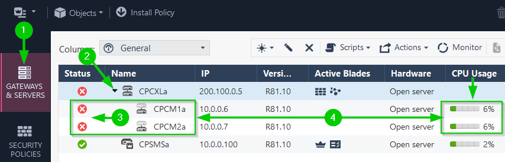

 ***Figure 9.30 — GATEWAYS and SERVERS new cluster state***

 ### Page 382

 >**Note**

 >The **Protections** options configuration for hosts is now deprecated, but still available. Do not use these options. Instead, use **Protected Scope** option in **Threat Prevention Policy**. We do not use either options in the book. This is for information only.

### Page 398

 >**Note**

 >Two NAT rules can be matched for the same connection only if both are automatically-generated, whereas if a single manual NAT rule is matched no others can be.

## Chapter 11 — Building Your First Policy

### Page 433

In ***Figure 11.6 | Rule 10***, only `.time.windows.com` object is used as a destination. Create additional domain objects, as described on **Page 434**: 
```
add dns-domain name ".ntp.checkpoint.com" is-sub-domain false
add dns-domain name ".ntp2.checkpoint.com" is-sub-domain false
```
and add them to the same Destination cell in Rule 10.
Later, when the policy is installed, revisit Gaia WebUI of the **CPSMS** and **CPCM2** and change their **Time Settings** to **Set time and Date automatically using Network Time Protocol (NTP)**, as shown on **Page 193**, ***Figure 5.41***.

### Page 434

1. ***Figure 11.7 | Rule name*** has a typo: **acccess** should be **access**
2. ***Figure 11.7 | Destination*** cell, shows object **Router**, which does not exist. Replace it with **RouterLeft** object created earlier.
 
### Page 436

1.	**Rule 17** is named incorrectly but functioning as intended. Replace **Internal2** with **Internal1** in the rule name only.
2.	Configuring rules for access to updatable objects will not work as described until **CPSMS** can connect to the internet and access Check Point cloud services. To address this, first, configure the **Rule 19** (***Figure 11.10***) as:

 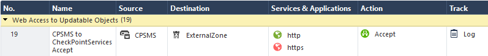

***Figure E11.10a — CPSMS to ExternalZone access rule***
 
Publish changes and install the policy.
After successful policy installation, In **GATEWAYS & SERVERS**, your cluster members change status from red ***X** to green checkmark **after a few minutes**:
 
 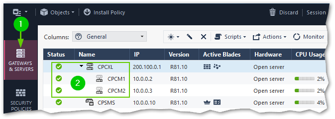

***Figure E11.10b — First Time Policy Installation***

Then, change the **Rule 19** by adding **SmartConsole_VM** to the **Source** field, deleting **ExternalZone** from **Destination** field and replacing it with **Check Point Services** updatable object to match what is depicted in ***Figure 11.10***:


***Figure E11.10c — CPSMS and SmartConsole_VM to ExternalZone access rule***

One thing to note is that not all ***Updatable Objects*** may have associated icons at this point (they are in the process of being downloaded), so you may see the rule looking like this:

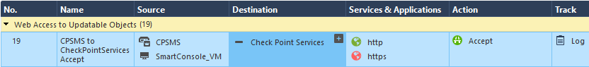 	 

***Figure E11.10d — Updatable Objects with no Icon***

This is immaterial- the icon will be updated automatically in time as Check Point services are now reachable.
Continue working on the rest of the policy.

 ### Page 449
Latest releases of web browsers updated the certificate handling interface. Now, instead of the legacy **Certificate** popup (left), you will see a newer one (right):

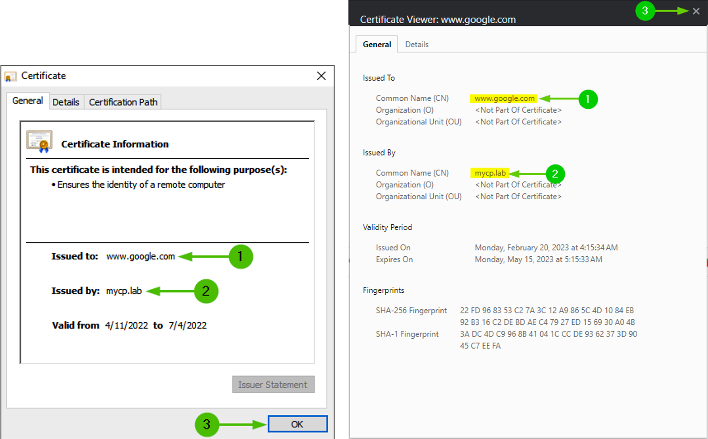
 
 ***Figure E11.29 — New Cert Interface Action 1***

### Pages 451-452

Similarly, for actions depicted in the paragraph above and in Figure 11.31 - Preparing the management server’s certificate for distribution, certificate interface is changed and now, in **Certificate Viewer** [1], Click on **Details** [2], In **Certificate Hierarchy** section, select top-most line [3] and click **Export** [4]:
 
 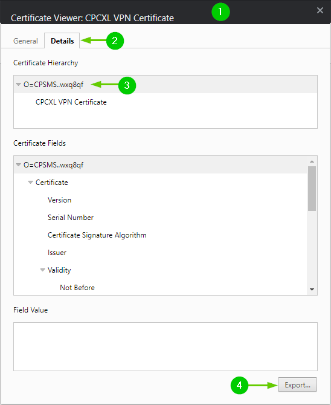
 
 ***Figure E11.29 — New Cert Interface Action 2***
 
 1.	In **Certificate Export Wizard**, navigate to ***LabShare***.
 In File name, type in cpsms.mycp.lab, change the Save as type setting to DER Encoded Binary, single certificate, and click on Save. Close the browser’s Certificate Viewer.
 2.	Now, open LabShare and repeat the installation of this certificate for Local Machine in the Trusted Root Certification Authorities location, which is the same as the one we have used for the outbound CA we imported earlier.
 3.	Close our Incognito window browser instance and open a new Incognito window browser instance, navigate to another social networking site (for instance, Instagram), and you should be greeted with UserCheck’s Page Blocked notification but no more security warnings. To verify that our HTTPS bypass rules are working, visit one of the banking sites, such as www.citi.com or www.jpmorgan.com, and check the certificates’ properties for them. You will see that they present their own certificates and not the mycp.lab certificate used for the inspected traffic.
 4.	Repeat the installation of both certificates on the rest of the Windows VMs in the lab.
 5.	After both certificates are successfully installed, if you have running browser instances, close those and re-launch for new certs to take effect.
 Continue to Changing the website categorization to Hold mode section

### Page 454

>**Note**
>Instead of typing the commands by hand, if you are using physical book, from **ADDCDNS** **CMD** prompt, execute `F:\Scripts\add-ad_users.bat script`. This will prompt you three times for each of three user’s passwords. Enter `CPL@b8110` to keep it consistent.

### Page 459

After completing the instructions in the first sentence at the top of the page:
_Click on OK three times to exit Gateway Cluster Properties._
Do this:
Publish changes, Install Policy, close and reopen **SmartConsole** application before continuing.

### Page 461

When testing access role-based rules, use browser’s ***Incognito Mode*** and alternative sites, to avoid seeing results from cached, or not yet terminated sessions. I.e.: if you have tried accessing facebook.com as `mycp.lab\hruser`, try accessing Instagram.com as `mycp.lab\itadmin` to see the immediate difference in behavior. Otherwise, it’ll  take a few minutes for the same site to be, or not to be accessible for the newly logged-in user.

## Chapter 12 — Configuring Site-to-Site and Remote Access VPNs

### Page 467

In the last sentence of the first paragraph:
Wire mode can be used for dynamic routing through a VPN where gateways are used as transient nodes.
 ***transient*** should be ***transit***

### Page 468

***Step 3***

instead of:

_Execute `ping 200.200.0.1`…_

should be:

_Execute `ping 200.200.0.254`…_

### Page 469

In ***Step 4***, DO NOT click on **Communication** button (***label 4***). 
Note:
Until our **CPCXL** cluster is aware that **CPGW** is a Check Point gateway, communication between our management server and **CPGW** will not be permitted by the preexisting **Implied Rules**.

Instead:

With **Gateway’s Name** [1] and **IPv4 Address** [2] defined and with **Secure Internal Communication Unitialized** [3], click **OK** [4]:
 
 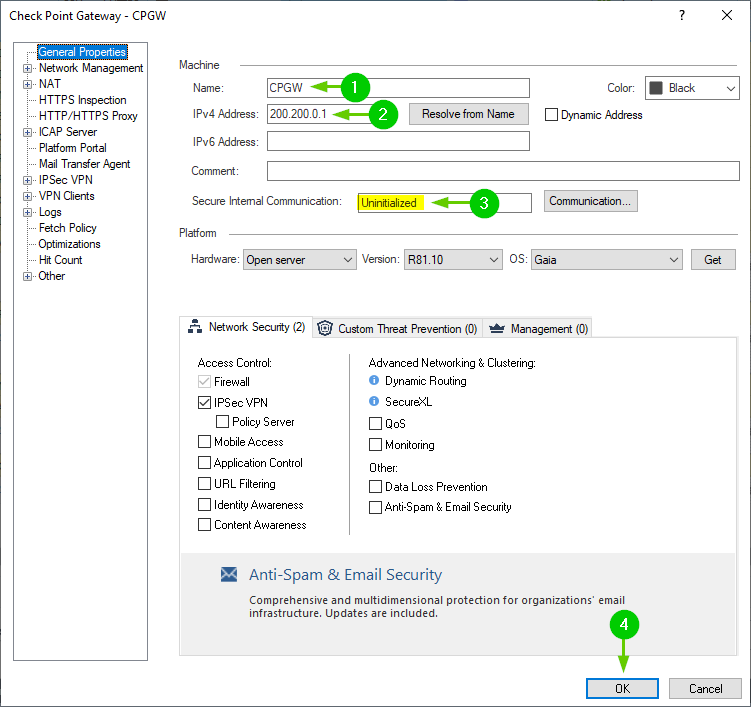
 
 ***Figure E12.2.a — Creating Uninitialized Gateway object***
 
1.	Ignore the warning about undefined interfaces [1] and lick **Yes** [2]:

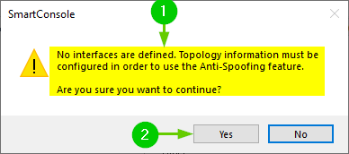

***Figure E12.2b — Confirming creation of the gateway object with undefined topology***
 
2.	Add newly created **CPGW** object to **Destination** field of **Rule 1**:

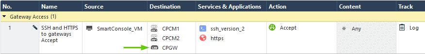

***Figure E12.2c — Including CPGW in the Gateway Access rule***
 
3.	Publish changes.
4.	Click on **Install Policy**. Verify that **Threat Prevention** is DESELECTED [1] and UNCHECK the checkbox for **CPGW** [2]. You must see the Install on 1 gateway out of 2 [3]. Click **Install** [4]:

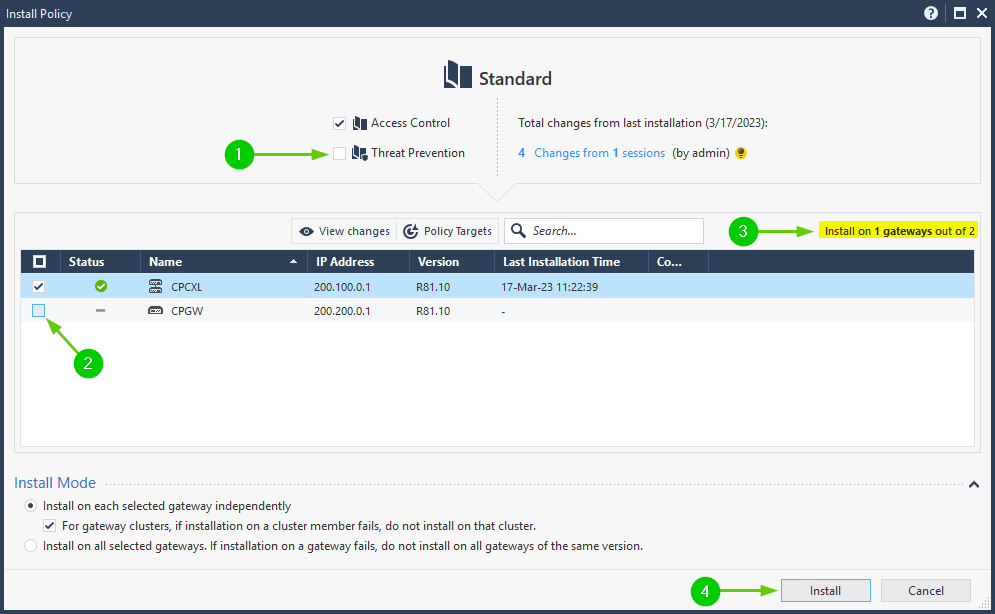

***Figure E12.2d — Excluding CPGW from Policy Installation targets***
 
5.	Double-click the **CPGW** object in **Rule 1**.
6.	Click **Communication** button and proceed with ***Step 5*** on **Page 470**.
7.	In ***Step 14*** on **Page 472**, ignore the instructions for adding the **CPGW** gateway to **Rule 1** (we have already done it in ***Step 3*** above), but do delete the **CPGW_tmp** object from **Objects|Network Objects|Hosts**.

### Page 477

***Step 1*** - add a fifth sub-step:

  •	In **Rule 21** (***APCL_URLF Parent Rule***) [5]

### Page 478

***Figure 12.12*** should now look like this:

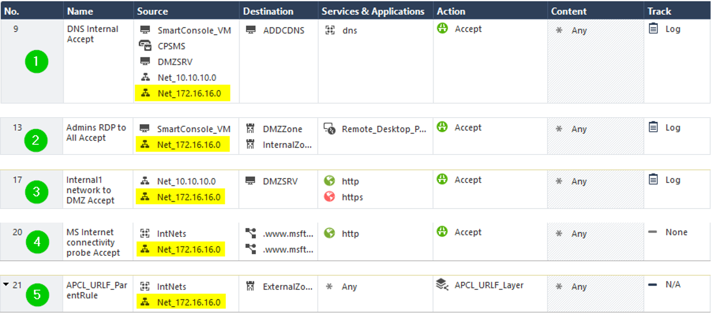

***Figure — 12.12 The modified rules for site-to-site VPN access from the remote side***

>**NOTE**

>_You can further restrict rules applicable to VPN traffic by selecting specific VPN community in VPN column. Doing this will require creating additional rules for the sources and destinations that are on the other side of the VPN._

In ***Step 3**

On **RightHost**, change the DNS settings by adding `10.20.20.10` (**ADDCDNS**)
as a secondary DNS server.

Should be:

On **RightHost**, change the DNS settings by replacing `9.9.9.9` with `10.20.20.10` (**ADDCDNS**) as your primary DNS server.

>**Note**

>Windows using ONLY primary DNS server, so long as it is responding, even if it cannot resolve the host name.

>**Note**

>It is also a good idea at this point to replace the **domain-udp** object  in our **LeftSide_S2S** policy with dns **Service Group** object  . This allows both, **UDP** and **TCP** for DNS to accommodate responses larger than 512 bytes.

In ***Step 4***

>**Note**
>You are instructed to initiate the RDP or HTTP traffic to any of the hosts on the Left Side (e.g., HTTP or RDP to DMZSRV.mycp.lab). While HTTP will succeed, RDP will fail, since we do not have RDP configured on DMZSRV yet. This is beside the point since all we are interested in, is generating traffic. Even unsuccessful RDP attempt will be logged as encrypted and decrypted:
 
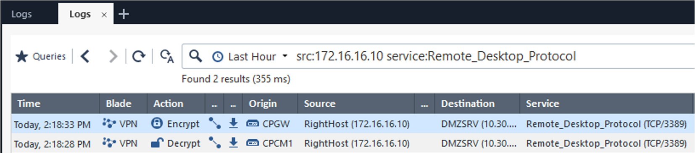

***Figure E12.P478 — Logging of VPN connection to non-running service***

### Page 479

***Step 3*** is redundant. Ignore it- we already are using `10.20.20.10` as primary DNS server on **RightHost**.

### Page 480

After you’ve added the two NAT rules, publish changes, and install the **LeftSide_S2S** policy, before moving to ***Step 7***.

### Page 481

1.	Disregard ***Step7*** and ***Step 8***. There are no rules configured in our policy to allow this traffic.
2.	In ***Excluding a satellite gateway’s external IP from the VPN*** section, the paragraph:
Try the following exercise: SSH into **CPGW** and ping our router’s IP, `200.200.0.254`. In the SmartConsole logs, use the `src:200.200.0.1 AND service:icmp-proto` filter, and you will see the encrypted [1] and decrypted [2] traffic from **CPGW** traversing **CPCXL** member **CPCM1**, and the ***Figure 12.16*** 
 
 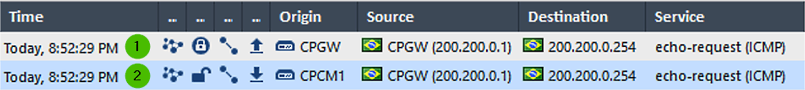
 
***Figure 12.16 — Unexpected encrypted traffic***

Should be:
To demonstrate, let’s enable **Accept ICMP requests** and enable **Log Implied Rules** option in the **Main Menu|Global Properties**. This process is described later, on **Page 493** in ***Step 1*** (***Figure 12.26 - Global Properties, FireWall for ICMP, and implied rules tracking***) publish changes and install the policy **LeftSide_S2S**. 
Now, try the following exercise: SSH into **CPGW** from **SmartConsole_VM** and from it, ping our router’s IP, `200.200.0.254`. In the SmartConsole logs, use the `src:200.200.0.1 AND service:icmp-proto` filter, and you will see the decrypted [1] traffic from **CPGW** [2] traversing **CPCXL** member **CPCM1** [3], with the echo-reply being dropped [4] by **CPGW** [5]:

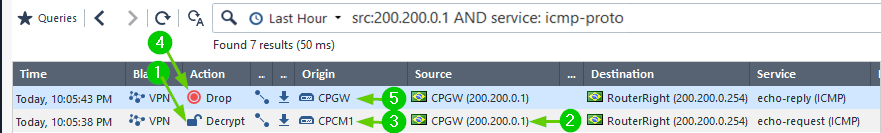
 
***Figure 12.16 — Unexpected encrypted traffic***

### Page 483

Last paragraph of the section:
_Note that we did not remove 200.200.0.1 from the encryption domain of CPGW but simply restricted traffic sourced from it from being encrypted._

Should be:

_Note that traffic sourced from 200.200.0.1 is now excluded from the VPN and is not routed over the tunnel, using the Gaia routing instead._

### Page 489

The last paragraph before Configuring a Gateway or cluster for remote access section, that reads:
_Let’s create a new network object, **Net_192.168.254.0**, with a `192.168.254.0`_
address and a `255.255.255.0` mask.

Should be:

_Let’s create a new network object, **Net_192.168.254.0**, with a `192.168.254.0`
address and a `255.255.255.0` mask. Set it’s NAT properties to Hide behind gateway and Install on gateway: **CPCXL**. Add this network object to the **Int_Nets** group.

### Page 497

Configuring access control policy rules for remote access

**Step 1** should be:

1.	Add **Net_192.168.254.0** to:
  A.	***Rule 4 (DHCP relays and to clients Accept) Destination field.***
  B.	***Rule 5 (DHCP replies to clients Accept) Destination field.***
  C.	***Rule 9 (DNS Internal Accept) Source field.***

### Page 499

***Step 1***

_Rename the newly pasted rule and replace the **Int_Nets** object in the **Source** field with the **RA_Role** access role (both the original and new rules are shown) [1]:_

Should be:

_Rename the newly pasted rule and replace the *Any in the Source field with the RA_Role access role (both the original and new rules are shown) [1].
***Figure 12.33*** should look like this:_

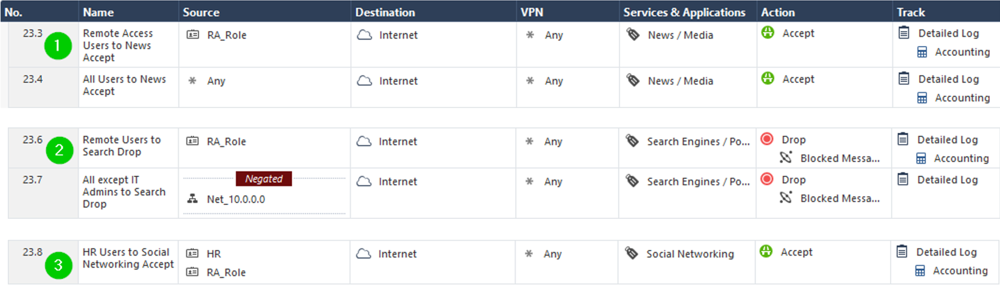

***Figure 12.33 — The application control layer rules created or modified for the lab***

***Step 4*** - After Publish changes and Install the policy  executed, you are presented with Confirm Policy Override window [1]. Click Install [2] to complete the process :
 
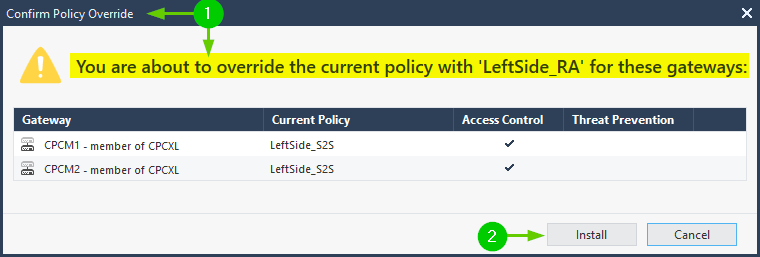

***Figure E12.33b — Policy Override Confirmation***

### Page 500

Instead of typing the code-block by hand, you can execute new script `addcdns_add_RA_DHCP_Range.bat` (calling `addcdns_add_RA_DHCP_Range.ps1`) from **ADDCDNS** VM’s **CMD** prompt. 

### Page 502

1. **Login Option Selection**, leave it as **Standard (Default)** and click **Next**:
Should be:
   **Login Option Selection**, leave it as **vpn (Default)** and click **Next**:
This is due to changes in the newer VPN clients’ releases. Same goes for Figure 12.37 – Remote access VPN login option selection on Page 503.

2. After ***Step 9***, you are prompted with ***The site’s certificate is not trusted!*** warning [1]. Click **Trust** and **Continue** [2]:

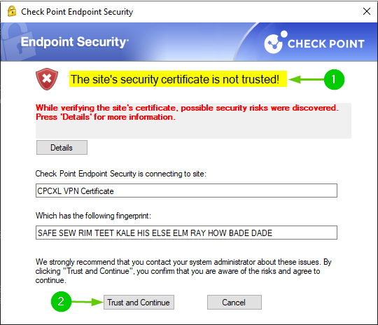

***Figure E12.36b — Sites Certificate is not trusted***

This is normal, as **Check Point Endpoint Security** client is performing reverse lookup of the IP to the name that the certificate is issued to. Since we are using “fake” public IPs, it will resolve to some host in Brasil, hence the warning.

### Page 504
***Step 15*** 

**RA_user1** username should be **Ra_user1**, it is case-sensitive. Same goes for the ***Figure 12.40 – The Endpoint Security authentication and connection prompt*** on **Page 505***.

### Page 510

Section title typo:

***Logging into a single security domain***

Should be:

***Logging in a single security domain.***

## Chapter 13 — Introduction to Logging and SmartEvent

### Page 526
>**Note**
> In ***Step 4***, either wait for a few minutes before opening **New Tab** or close and re-open **SmartConsole** to see the **SmartEvent Settings & Policy** under **External Apps**.

### Page 530

Missing steps before we can see the view depicted in the ***Figure 13.20 – The General Overview dashboard for SmartEvent***.
To get to that point:
1.	Open **General Overview**, in **Timelines** (bottom-left) section, there is only **Security Incidents (by Logs)** empty timeline.
2.	Click on **Options | Edit** in the top-right corner of the view:

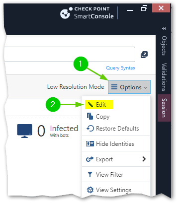

***Figure E13.20a — General Oerview Editing Timelines Step 1***
 
3.	Now, in **Timelines** [1] and in each of the view’s Widgets, we can see the editing menu [2]. Click on **Ad**d in the **Editing Menu** of **Timelines** [3] and click **Timeline** [4]:

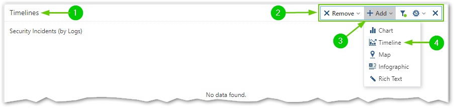

***Figure E13.20a — General Oerview Editing Timelines Step 2***
 
4.	In **Timeline** popup window [1], enter **Applications and URL Filtering (by logs)** in both, **Title** and **Description** [2]. Select round graph vew [3]. Click on **Stacked by:** drop-down menu [4], scroll down [5] and click on **Application Risk (Count)** [6]. Click **OK** (not pictured), to finish adding the custom timeline to your timelines  widget:

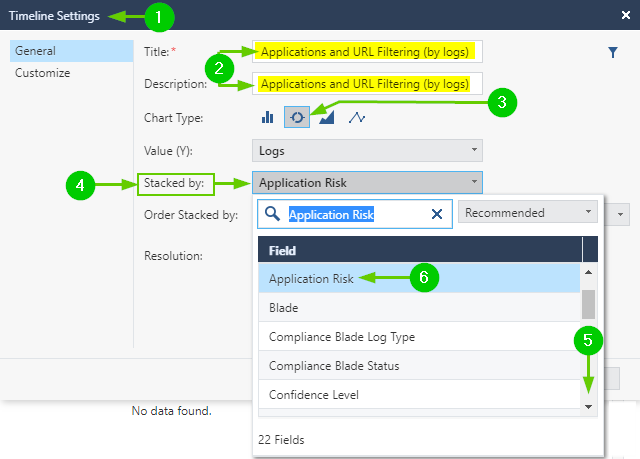

***Figure E13.20c — General Oerview Editing Timelines Step 3***
 
5.	Now, you will see the **General Overview** depicted in original ***Figure 13.20 – The General Overview dashboard for SmartEvent***.
6.	On top of the view, in **Edit Mode** menu [1], click **Done** [2] to commit the changes to the view:
 
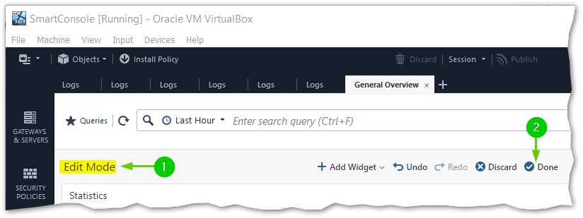

***Figure E13.20d — Saving edited Views***

## Chapter 15 – Performing Basic Troubleshooting
### Page 574
In **Table 15.2**
**APC** should be **APCL** 

## General Weirdness and Recommendations
1.	Microsoft is taking liberties with feature enablement without explicitly describing their consequences to the users.
Case in point is the Hyper-V, which could be enabled in your Windows instance by any number of the features (see the list from 2022 here: https://forums.virtualbox.org/viewtopic.php?f=1&t=62339).
Theoretically, VirtualBox can coexist with Hyper-V and use it as a paravirtualization interface for VMs, but this feature is still experimental and some OS are having issues running with Hyper-V enabled.
Should you encounter the stability or performance issues in your lab, in Windows CMD, execute command `systeminfo` and, looking at the bottom of its’ output:

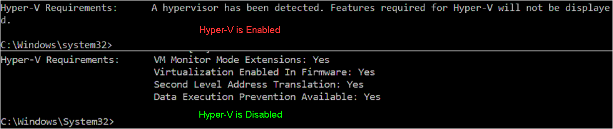

***Figure EGWR1 — Determining Hyper-V status on LabHost PC***
 
We can determine if Hyper-V is enabled should you see **A hypervisor has been detected. Features required for Hyper-V will not be displayed.**
To ensure that your VirtualBox is an exclusive virtualization stack, verify that none of the Hyper-V features listed at the above URL are critical for you. Then, in **ELEVATED CMD** prompt of the **LabHost**, execute:
`bcdedit /set hypervisorlaunchtype off`
Shutdown your **LabHost** PC COMPLETELY (do not reset) and power it up again for these changes to take effect. On LabHost PC, use command:
`shutdown /s /t 0`
To ensure proper shutdown.
 
2.	If at any point during the lab build, your cloned Check Point VMs will get stuck on boot [1], with the progress bar [2] refusing to budge:

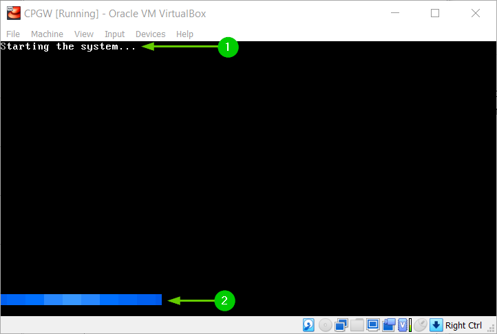

***Figure EGWR2 — Check Point VM stuck in boot after FTW***
 
Click on Machine [3] and click Reset [4]:

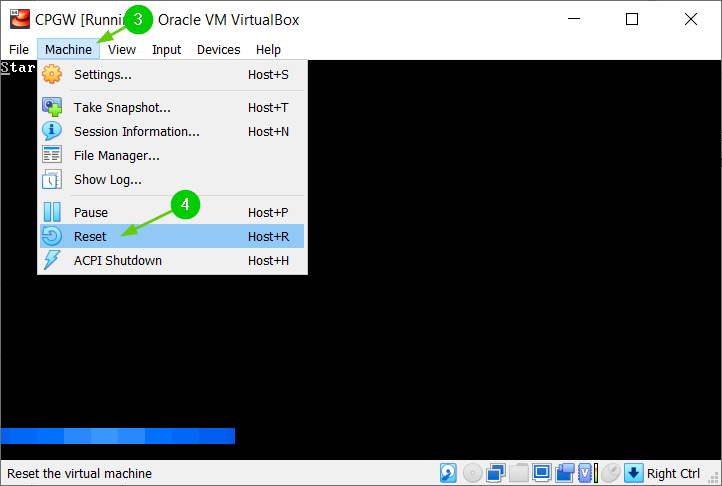

***Figure EGWR3 — Resetting stuck Check Point VM***
 
Click anywhere within that VM’s console and press any key within firs five seconds to invoke boot options selector. If you’ve missed the five second window, simply repeat the Reset process.
In Boot options selector , using arrow keys [5] select Start in 64bit online debug mode [6]:

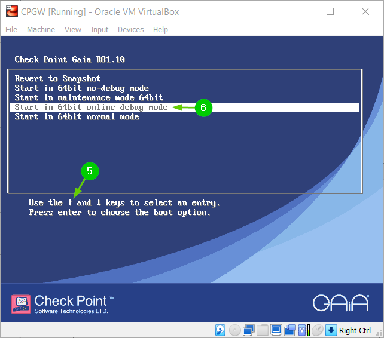

***Figure EGWR4 — Choosing Check Point Start in 64bit online debug mode***
 
…and if the cloned VM boots normally with verbose boot debug output, modify VM's configuration using these steps:
  A.	Shut this VM down and, in Oracle VM VirtualBox Manager
  B.	VM’s Settings, uncheck the “Enable Serial Port” checkbox and click OK.
  C.	Boot VM normally ignoring these warnings:
  
  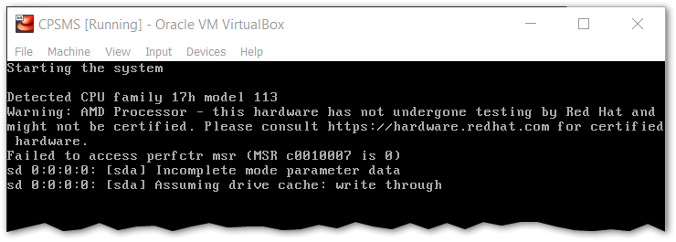
  
  ***Figure EGWR5 — Ignoring irrelevant Check Point boot posts***
  
  D.	Repeat the same action for all your Check Point VMs.
This was observed on AMD LabHost running VirtualBox 7 with CheckPoint R81.10 after completion of the First Time Configuration Wizard.


-----END-----
